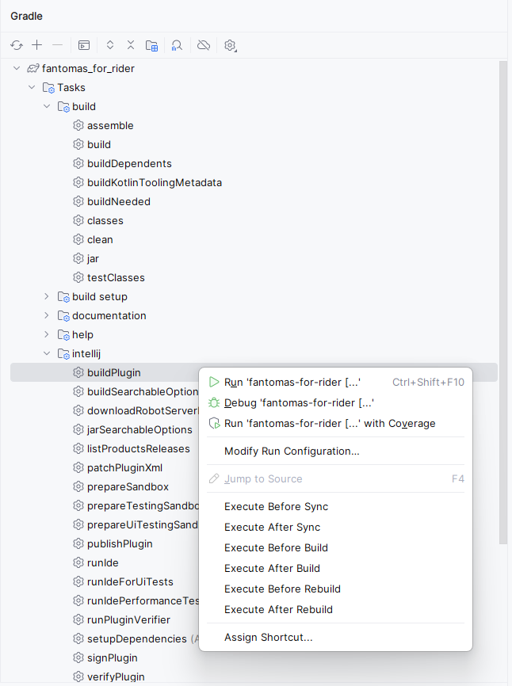
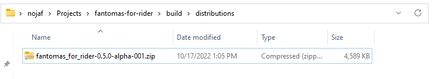

# How to publish

If it all still works (and that is a big if 😅🙈😸).
Run `buildPlugin` from the Gradle menu.

This should create a zip in `build\distributions`

And that you can upload in https://plugins.jetbrains.com/plugin/18268-fantomas